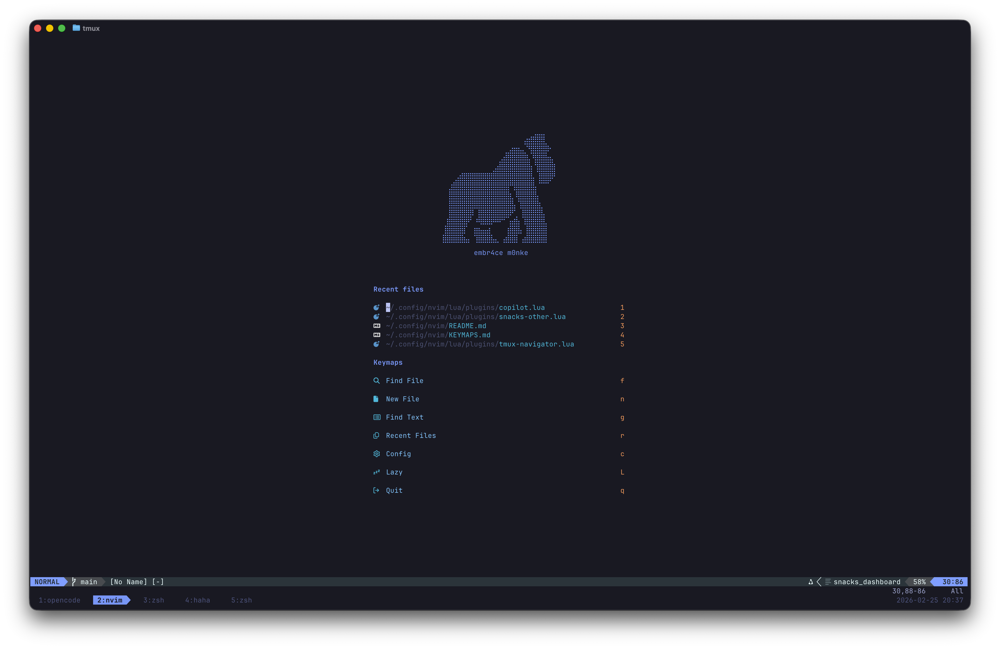
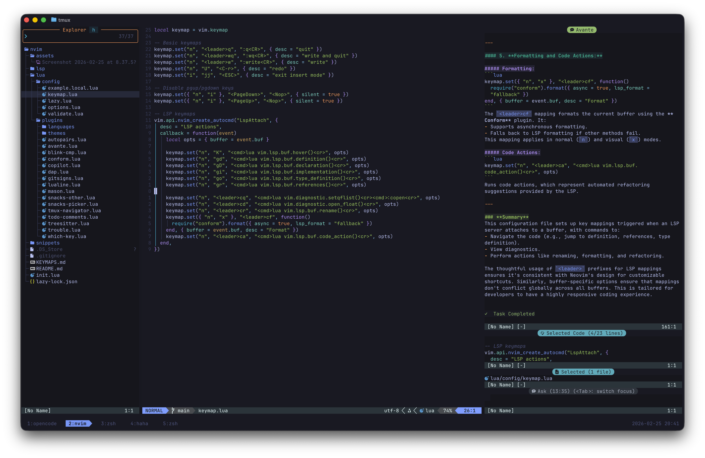

# nvim

Personal Neovim configuration built on [lazy.nvim](https://github.com/folke/lazy.nvim) with native LSP (Neovim 0.11+).

<p>
  
  
</p>

## Requirements

- Neovim 0.11+
- Git
- A [Nerd Font](https://www.nerdfonts.com/) (for icons in statusline, file explorer, etc.)
- [ripgrep](https://github.com/BurntSushi/ripgrep) (for live grep via snacks picker)
- [fd](https://github.com/sharkdp/fd) (for file finding via snacks picker)
- A C compiler (for treesitter parser compilation)
- [tmux](https://github.com/tmux/tmux) (optional, for split navigation with `C-h/j/k/l`)

## Features

- **Native LSP** -- uses Neovim 0.11+ `vim.lsp.enable()` with `lsp/` directory convention, no lspconfig needed
- **Autocompletion** -- blink.cmp with LSP, snippets, buffer, and path sources
- **Fuzzy finder** -- snacks.nvim picker for files, grep, buffers, git branches, and file explorer
- **Formatting** -- conform.nvim with format-on-save (stylua for Lua, terraform_fmt for Terraform, LSP fallback)
- **Syntax highlighting** -- treesitter with parsers for all configured languages
- **Diagnostics** -- trouble.nvim for a pretty diagnostics list, symbols outline, quickfix/location list, and LSP references panel
- **Todo comments** -- todo-comments.nvim highlights TODO/FIXME/HACK/NOTE in code with search and Trouble integration
- **Debugging** -- nvim-dap with UI, Go and Python adapters out of the box
- **AI** -- GitHub Copilot inline suggestions and Avante chat interface
- **Git** -- gitsigns for change indicators in the sign column
- **Dashboard** -- snacks.nvim startup screen with recent files
- **Statusline** -- lualine with material theme
- **Autopairs** -- mini.pairs for automatic bracket/quote closing
- **Terminal** -- snacks.nvim toggleable floating terminal
- **Tmux integration** -- seamless split navigation between Neovim and tmux panes
- **Feature flags** -- toggle languages, AI, debugging, and themes via a local config file

## Mason Packages

Mason provides LSP servers, formatters, linters, and debug adapters. Install packages manually with `:MasonInstall`.

The following packages correspond to each `Config.languages` flag:

| Flag | Packages |
|------|----------|
| _always_ | `stylua` |
| `python` | `pyright`, `ruff`, `debugpy` |
| `lua` | `lua-language-server` |
| `java` | `jdtls` |
| `go` | `gopls`, `delve` |
| `terraform` | `terraform-ls`, `tflint` |
| `rust` | `rust-analyzer` |
| `c` | `clangd` |
| `typescript` | `typescript-language-server` |

Quick install example for a Python + Go setup:

```vim
:MasonInstall stylua pyright ruff debugpy gopls delve lua-language-server
```

## Keybindings

Leader key is `<Space>`. See [KEYMAPS.md](KEYMAPS.md) for the full reference.

## Local Configuration

The shared configuration works out of the box with sensible defaults. To customize settings for your machine without affecting the shared repo, create a local config file:

```sh
cp lua/config/example.local.lua lua/config/local.lua
```

`lua/config/local.lua` is gitignored and will never be committed. It is loaded before plugins, so any overrides you set there take effect before anything else runs.

### Feature Flags

The configuration exposes a global `Config` table with feature flags. Override any of them in your `local.lua`:

```lua
-- Disable AI features
Config.copilot = false
Config.avante = false

-- Disable debugging support
Config.dap = false

-- Turn off languages you don't need
Config.languages.java = false
Config.languages.terraform = false

-- Enable languages that are off by default
Config.languages.scala = true

-- Switch the colorscheme
Config.theme = "catppuccin"
```

Disabling a language turns off its LSP server(s) and any related plugins.

#### Available Flags

| Flag | Default | Controls |
|------|---------|----------|
| `Config.theme` | `"tokyonight-night"` | Colorscheme (`"tokyonight-night"`, `"catppuccin"`, `"rose-pine"`) |
| `Config.copilot` | `true` | GitHub Copilot |
| `Config.avante` | `true` | Avante AI assistant |
| `Config.dap` | `true` | Debug Adapter Protocol (nvim-dap + UI) |
| `Config.languages.python` | `true` | pyright, ruff |
| `Config.languages.lua` | `true` | lua_ls, lazydev |
| `Config.languages.java` | `true` | jdtls, nvim-java |
| `Config.languages.go` | `true` | gopls, nvim-dap-go |
| `Config.languages.terraform` | `true` | terraformls |
| `Config.languages.rust` | `true` | rust-analyzer |
| `Config.languages.c` | `true` | clangd |
| `Config.languages.typescript` | `true` | tsls |
| `Config.languages.scala` | `false` | nvim-metals |
| `Config.languages.markdown` | `true` | render-markdown.nvim |

### Other Overrides

Since `local.lua` is plain Lua loaded early in the startup sequence, you can also override editor options, add keymaps, or set machine-specific paths:

```lua
vim.opt.tabstop = 4
vim.opt.shiftwidth = 4
vim.opt.clipboard = ""
vim.g.python3_host_prog = "/opt/homebrew/bin/python3"
vim.keymap.set("n", "<leader>xx", "<cmd>echo 'hello'<cr>", { desc = "Example" })
```
